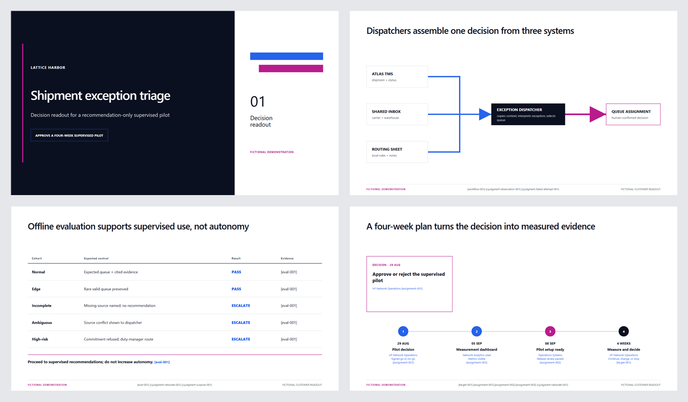

# AI on the job

[](https://skills.sh/likamrat/skills)

Agent Skills for people who use AI in their work.

Each skill describes how a body of work should be carried out: what evidence to collect, which decisions require human judgment, what artifacts to produce, and what conditions should stop or redirect the work.

Skills are grouped by the role or practice they support.

## Installation (30-second setup)

Install a named skill with the open [`skills`](https://github.com/vercel-labs/skills) CLI. This example installs `fde-engagement`:

```bash
npx skills@latest add likamrat/skills --skill fde-engagement
```

The installer detects your supported agents and asks where to install the skill.

For a non-interactive GitHub Copilot project install:

```bash
npx skills@latest add likamrat/skills --skill fde-engagement --agent github-copilot -y
```

Then ask your agent:

```text
Use fde-engagement to qualify this customer problem.
Start by asking for the smallest evidence package that unlocks the decision.
```

No additional project setup is required.

Installation commands live in this section. Skill READMEs link here instead of copying commands that can drift.

## Skill catalog

### Forward deployed engineering

| Skill | Use it for |
|---|---|
| [`fde-engagement`](skills/fde/fde-engagement/README.md) | Qualify, audit, design, evaluate, deploy, review, and report on an end-to-end FDE customer engagement |
| [`fde-readout`](skills/fde/fde-readout/README.md) | Plan and deliver evidence-bound FDE customer or leadership readouts as interactive HTML, editable PowerPoint, or both |

#### `fde-engagement`

The skill requires the agent to:

- qualify FDE fit before recommending embedded engineering;
- reconstruct the real workflow from operators, systems, and cases;
- question decisions in dependency order;
- preserve human-confirmed observations, failures, surprises, and rationale;
- maintain a shared domain model;
- separate deterministic software, model judgment, and human authority;
- gate rollout on eval, recovery, monitoring, and adoption evidence;
- record field evidence that may support product changes;
- generate customer reports, leadership updates, and PowerPoint readouts;
- reject unsupported claims, generic prose, and visual filler.

#### `fde-readout`

The skill requires the agent to:

- use one validated `ReadoutPlan` for HTML and PowerPoint;
- bind slide claims, metrics, risks, and timelines to evidence;
- plan with deterministic slide families before layout;
- run dependency-free HTML decks on localhost;
- use native Office authoring or an approved optional HTML-to-PPTX converter;
- inspect every HTML and PowerPoint slide independently.



Preview: cover, pilot decision, current workflow, and offline evaluation.

The [`fde-readout` guide](skills/fde/fde-readout/README.md#example) includes the plan, interactive HTML, editable PowerPoint, and preview.

The same example also includes an interactive HTML deck that runs on localhost with keyboard, touch, fullscreen, notes, and export mode.

## More install options

Preview the repository without installing:

```bash
npx skills@latest add likamrat/skills --list
```

Select every skill, then choose the target agents:

```bash
npx skills@latest add likamrat/skills --skill '*' --agent github-copilot -y
```

Install to a user-level directory:

```bash
npx skills@latest add likamrat/skills --skill fde-engagement --global --agent github-copilot -y
```

Use the skill for one session without installing it:

```bash
npx skills@latest use likamrat/skills --skill fde-engagement
```

Update installed skills:

```bash
npx skills@latest update --project -y
```

## Repository structure

```text
.
├── drafts/
│   └── README.md
└── skills/
    └── fde/
        ├── fde-engagement/
        │   ├── SKILL.md
        │   ├── README.md
        │   ├── assets/
        │   ├── evals/
        │   ├── references/
        │   └── scripts/
        └── fde-readout/
            ├── SKILL.md
            ├── README.md
            ├── assets/
            ├── evals/
            ├── references/
            └── scripts/
```

Each installable skill has a `SKILL.md` whose `name` matches its directory. Categories may contain multiple skills.

`skills/` contains installable packages. Work in `drafts/` uses `SKILL.draft.md` so the installer does not discover it.

## skills.sh

This repository follows the [Agent Skills specification](https://agentskills.io/specification.md) and is discoverable by the `skills` CLI.

`skills.sh` uses anonymous CLI install telemetry to build its listings and rankings. Its public documentation does not define a separate publish command. After a release reaches the public default branch:

1. verify discovery with `npx skills@latest add likamrat/skills --list`;
2. install the public repository once with the command above;
3. allow the skills.sh index to process the install;
4. check [`skills.sh/likamrat/skills`](https://skills.sh/likamrat/skills).

## Quality and safety

Every skill must:

- use precise trigger and anti-trigger language;
- keep core instructions concise and disclose references only when needed;
- include behavior and near-miss evals;
- validate any deterministic artifact or gate it creates;
- keep end-user installation commands in this README only;
- describe present behavior and inventory instead of promised additions or launch language;
- name actors, evidence, actions, controls, and consequences instead of using branding metaphors;
- use periods, commas, colons, or parentheses instead of em dashes;
- avoid customer data, credentials, and proprietary examples;
- distinguish observed evidence from inference and recommendation;
- pass the repository validation command.

Run:

```bash
npm run check
```

`npm run check` validates local paths and heading anchors. Run `npm run check:links` before release to check external URLs.

## Contributing

See [`CONTRIBUTING.md`](CONTRIBUTING.md) for the category layout, authoring contract, and release checklist.

## License

MIT. See [`LICENSE`](LICENSE) and [third-party notices](THIRD_PARTY_NOTICES.md).
